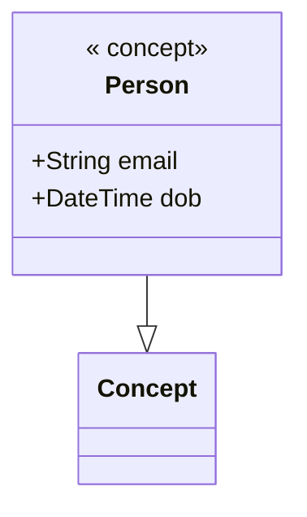

Markdown is a lightweight markup language for creating formatted text using a plain-text editor. 

```base
concerto compile --model test.cto --target markdown
```

## Sample Output

````markdown
# Namespace test@1.0.0

## Overview
- 1 concepts
- 0 enumerations
- 0 assets
- 0 participants
- 0 transactions
- 0 events
- 1 total declarations

## Imports
- concerto@1.0.0.Concept
- concerto@1.0.0.Asset
- concerto@1.0.0.Transaction
- concerto@1.0.0.Participant
- concerto@1.0.0.Event

## Diagram

````

## Options

None.

## Limitations

1. Scalars are unboxed as properties